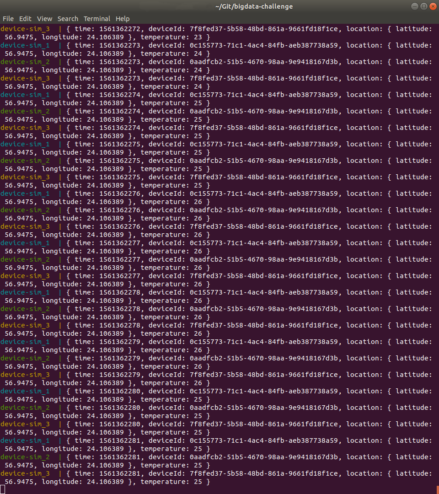
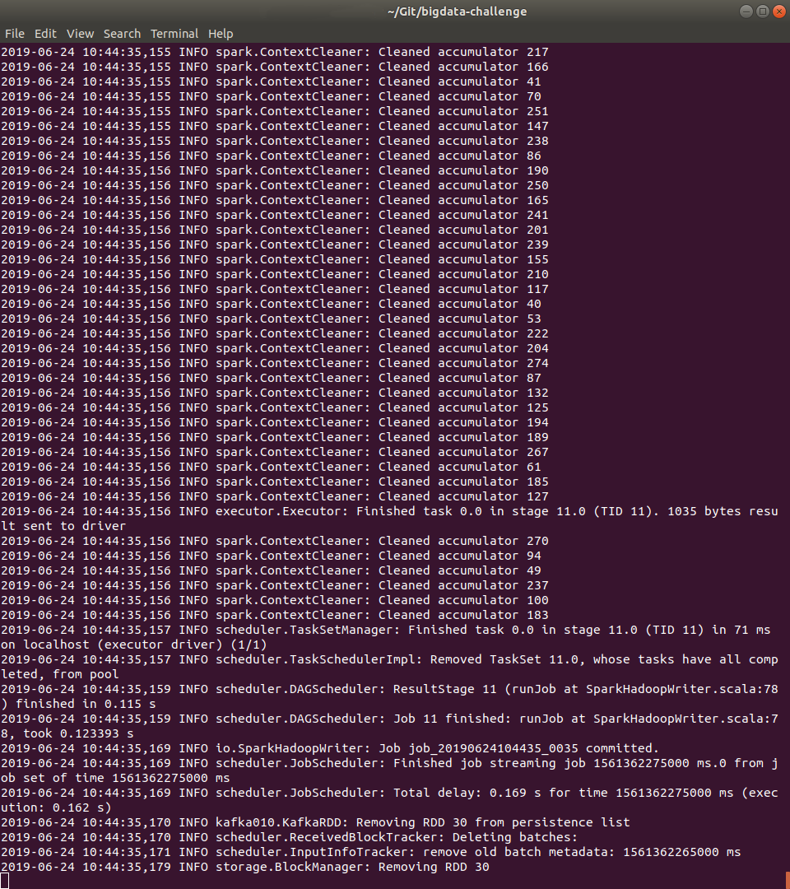
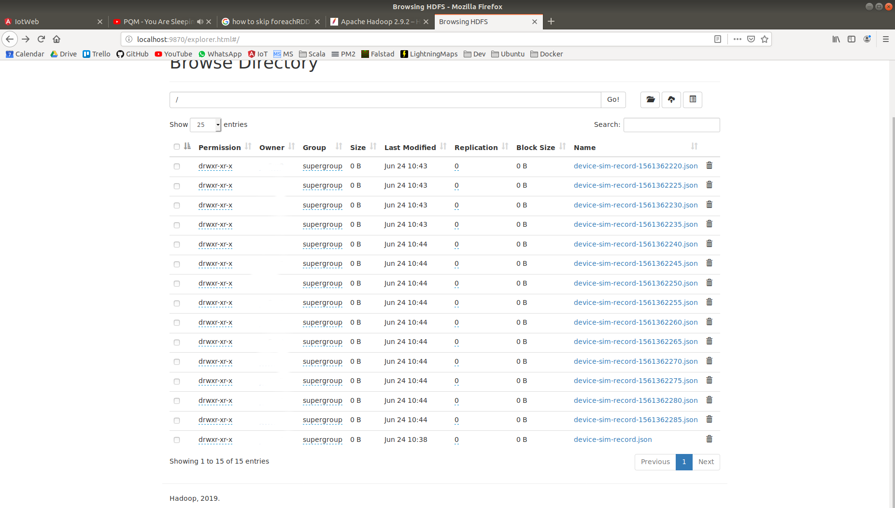
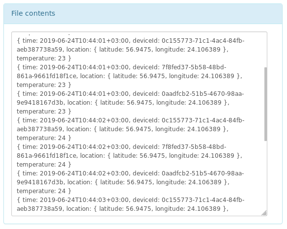

# Big Data Challenge

## 3rd party

* Scala - `2.12.8`
* SBT - `1.2.8`
* Spark - `spark-2.4.3-bin-without-hadoop-scala-2.12`
* Hadoop - `3.2.0`
* Kafka - `2.2.1`
* Docker - `18.09.5`
* HBase - `2.2.0`

## Running this project

1. [Install Apache Kafka](https://kafka.apache.org/quickstart) 
    * I preffer to run it on separate VM;
2. [Download and setup Apache Hadoop 3.2.0](http://hadoop.apache.org/docs/stable/hadoop-project-dist/hadoop-common/SingleCluster.html);
3. [Download and setup the Apache Spark binaries](https://spark.apache.org/docs/latest/);
4. Format HDFS partition:
    * `./bin/hdfs namenode -format`
5. Run DFS (Name and Data nodes of HDFS): 
    * Assuming  you're in Hadoop HOME: `./bin/start-dfs.sh`;
6. Get the project sources: `git clone https://github.com/idenisovs/bigdata-challenge.git`;
7. Assembly the project sources: `sbt assembly`;
8. Build the Docker image for producer: `docker build --tag device-sim .`
    * See the`Dockerfiles` for details;
9. Run N-th number of producers (assuming the Kafka is up and running):
    * `docker-compose up --scale device-sim=3`
    * You can run the single producer on host machine: `./run-producer.sh` 
10. Run consumer: 
    * `./run-cosumer.sh`
11. Observe the content of HDFS here: http://localhost:9870/explorer.html

## Structure

### Sources

```
root
|
+---> core (shared objects)
|
+---> device-simulator (Producer)
|
+---> process-job (Consumer)
```

### Project

```           
              messages
device sim 1 ----------> +-------+
                         |       |      
device sim 2 ----------> | Kafka |
                         |       |
device sim 3 ----------> +-------+
                            |
                            | messages
                            V
                    +---------------+
                    | Spark         |
                    | +-----------+ |
                    | |process-job| |
                    | +-----------+ |
                    +---------------+
```

## Code in action

### Producer



### Consumer



### Files in HDFS



### The content of file in HDFS

